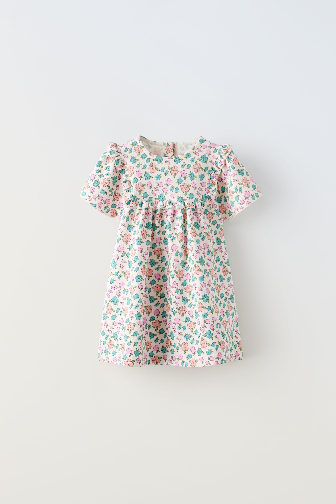
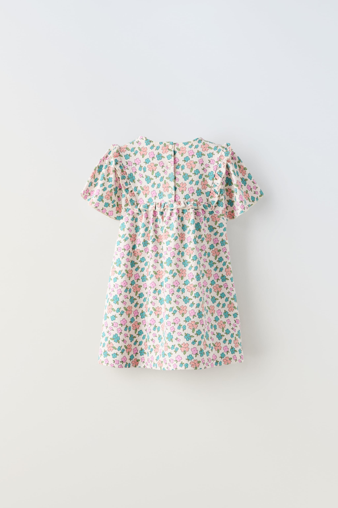
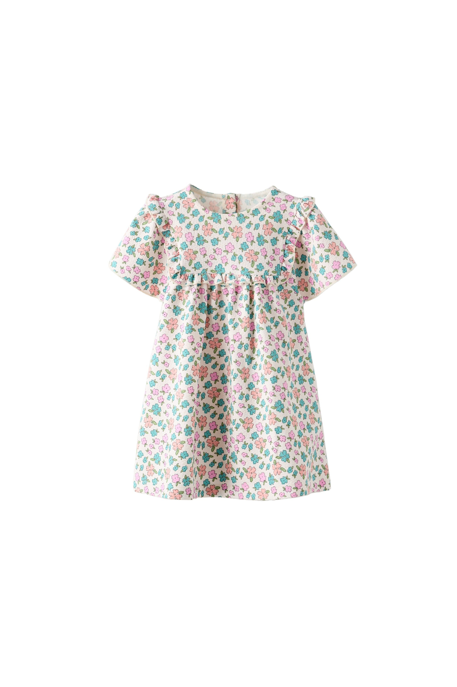

# inditex-similarity

     

Inditex-similarity is a project developed at [HackUPC](https://hackupc.com/) 2024. It tries to solve the challenge proposed by [InditexTech](https://www.zaratalent.com/es/tech/).  
The aim of the challenge is, given a dataset of garment images from various angles, developing an algorithm that identifies duplicated or very similar images not belonging to the same set.   Each set consists of three consecutive photos. An example is:
| | | |
| --- | --- | --- |
|  |  |  |
| | | |

## Proposed Solution
Our solution is a combination of deep learning models, that allow the retrieval of the closest images from our dataset, given a trio of images (such as the one above). Moreover, a LLM is included, which allows the users huge creativity, enabling them to find the most similar garment described in their own words.  
A tool such as this one can be very powerful, both for the retailer (for fostering sells) and for the customer (for finding the desired piece of clothing with maximum flexibility).

### Architecture

## Organization
This repository is organized in the following way:

## Contributors
This project has been developed by:

* Victor Conchello
&nbsp; <a href="https://www.linkedin.com/in/victor-conchello-vendrell/" rel="nofollow noreferrer">
     LinkedIn &nbsp; 
<a href="https://github.com/Victoriano012" rel="nofollow noreferrer">
     Github
  </a>

* Marc Franquesa 
&nbsp; <a href="https://www.linkedin.com/in/marc-franquesa-0015661b2/" rel="nofollow noreferrer">
     LinkedIn &nbsp; 
<a href="https://github.com/marcfranquesa" rel="nofollow noreferrer">
     Github
  </a>

* Mauro Filomeno 
&nbsp; <a href="https://www.linkedin.com/in/maurofilomeno/" rel="nofollow noreferrer">
     LinkedIn &nbsp; 
<a href="https://github.com/maurofr" rel="nofollow noreferrer">
     Github
  </a>

* Albert Fugardo &nbsp; &nbsp;
<a href="https://www.linkedin.com/in/albert-fugardo-cortada-575381205/" rel="nofollow noreferrer">
     LinkedIn &nbsp; 
<a href="https://github.com/AlbertFugardo" rel="nofollow noreferrer">
     Github
  </a>

