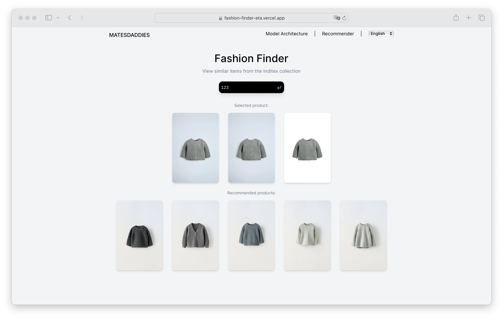

<h1 align="center">Fashion Finder</h1>

<h4 align="center">
    <a href="https://fashion-finder-eta.vercel.app">Website</a> | 
    <a href="https://github.com/marcfranquesa/fashion-finder-website">Website Repository</a>
</h4>

    

## Description

Fashion Finder is a full-stack application for visualizing and recommending products from Inditex's dataset. You can query the latest fashion clothing from its features (such as color and pattern) as well as find similar products based on a selected item. Queries are done with a vector search on embeddings calculated by a [CLIP model](https://github.com/maurofr/fashion-finder-model) and stored in MongoDB Atlas. It was built during [HackUPC 2024](https://hackupc.com) and submitted to the InditexTECH challenge.

## How it works

We first preprocessed the entire dataset (around 50k products with 3 images per item) and extracted an embedding for each product. Then, we saved these in MongoDB and created an application to perform the queries. Thanks to the CLIP model, we can create embeddings for images and text.

### Model

The extraction of the embeddings is a two-step process:

1. Image segmentation to identify the regions of interest of each image (the Inditex product). Then, replace everything else with the color green (the color was chosen based on perceptual results). [Model](https://github.com/levindabhi/cloth-segmentation).

2. Given the masked image, we feed it to a fashion fine-tuned CLIP model to get its embedding (the mask helps the model focus on the product). After attempting to train a Siamese network and a VAE, we ended up using a [pre-trained model](https://github.com/patrickjohncyh/fashion-clip) as it gave the best results. Our entire embedding extraction process can be found [here](https://github.com/maurofr/fashion-finder-model/tree/main/src).

    

### Website

To perform the queries on the dataset, we built an application using [Next.js](https://nextjs.org). Each product is saved in our database with an identifying index, three links (to each of the product's images), and a 512-dimensional embedding. We have two separate types of searches:

- [Based on a product index](https://fashion-finder-eta.vercel.app): it returns the three images of the selected product, as well as the 5 closest pieces of clothing.

- [Based on features](https://fashion-finder-eta.vercel.app/recommender): select from five different dropdowns to find the closest products to the query.

    

## Contact

- [Victor Conchello](https://github.com/Victoriano012)
- [Mauro Filomeno](https://github.com/maurofr)
- [Marc Franquesa](https://github.com/marcfranquesa)
- [Albert Fugardo](https://github.com/AlbertFugardo)
