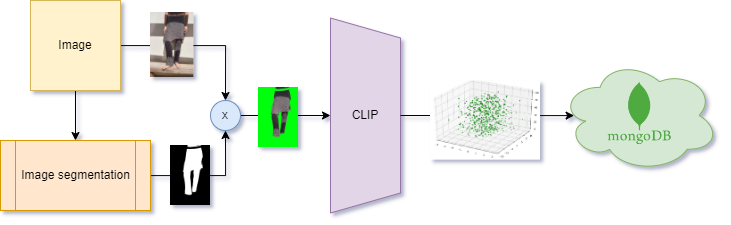
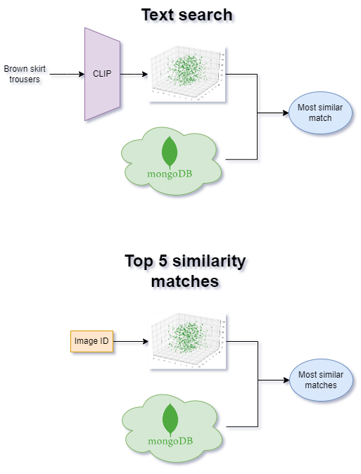

# Model architecture

In this section, we delve into the architecture of our model. Our approach is structured around two key phases: preprocessing and inference. In this discussion, we provide a breakdown of each phase, shedding light on their intricacies and significance within our model's framework.

## Preprocessing

In this first phase our aim is to generate a dataset of embeddings of the images. 

### Image processing

We are provided with a list of image urls. The images are in groups of 3, each group representing one product. As we will need to run inference and training several times over these images, we first aim to download each image to have a local dataset.

After dealing several times DDoS protection, we managed to download the whole dataset. The only downisde were around 1000 corrupted images out of 140k, which leaves us satisfied with the dataset.

### Clothing segmentation

After finding out that each image could have different backgrounds, settings and perspectives, we decided to use a clothing segmentation model to let the model focus on the important part of each image.

For each image, we run it through the model to retrieve the mask defining the region of interest, and change the background of the original image with a green screen (as ugly as this color can be, black can lead to some problems when analyzing dark clothes).

This process is done with a  pre-trained U2NET model for Cloths Parsing from human portrait. 

### Image embedding

With the dataset of masked images, we then want to retireve their embeddings (vector representations) to measure similarity between different clothes using the cosine similarity measure.

For that purpose, we use a pre-trained CLIP-like model, fine-tuned for fashion in a Zalando dataset of 71k labeled samples. 

### Uploading to MongoDB

Finally, we normalize the embeddings and average them over the images belonging to the same group. The resulting vectors are associated with the original url of the images of the group in a dataframe, that is then uploaded to MongoDB. This tool lets us then read the information from the front-end and efficiently search for the top-k similarity matches.

### Pipeline

We provide a sketch of the pipeline to sum up what has been just said.

## Inference

With a dataset of embeddings, associated to the images, and the ability to efficiently search the space for similar clothing, we are all set up for inference.

In our front-end, you have the ability to choose the features of the piece of clothing you want to find. This information, thanks to the choice of using a CLIP model, can be embedded into the same space as the images. The most similar results are returned to you.

Moreover, we can search from a specific image to find the 5 that are most similar to it. With this, we aim to give alternatives that look similar to the original.

Here is a sketch of this:

